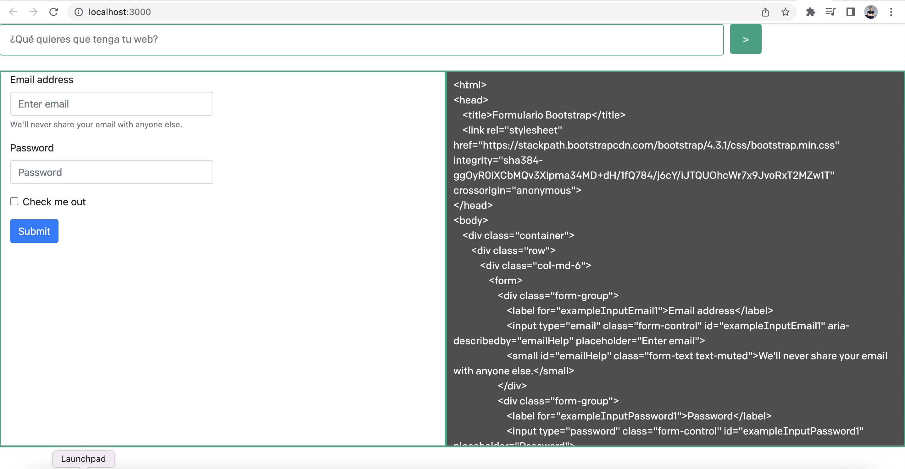

# Generate your web with OpenAI

This is a tool that uses OpenAI models to create html and it is able to be rendered. It uses the [Next.js](https://nextjs.org/) framework with [React](https://reactjs.org/).





## Setup

1. You need Node! (Node.js version >= 14.6.0 required)

2. Clone this repository

3. Open the project directory

4. Install dependencies

   ```bash
   $ npm install
   ```

5. Make a copy of the example environment variables file

   On Linux systems: 
   ```bash
   $ cp .env.example .env
   ```
   On Windows:
   ```powershell
   $ copy .env.example .env
   ```
6. Add your variables to the newly created `.env` file
   
   OPENAI_API_KEY= Your openai [api key](https://platform.openai.com/account/api-keys)

   OPENAI_MODEL= Recommended model is text-davinci-003. Check more [models](https://platform.openai.com/docs/models/gpt-3-5
   )

   OPENAI_MODEL_TEMPERATURE= Set the temperature. Recommended is 0. [Check more](https://platform.openai.com/docs/models/gpt-3-5)


7. Run the app

   ```bash
   $ npm run dev
   ```

Now you can use it at [http://localhost:3000](http://localhost:3000)

OpenAI [documentation reference](https://platform.openai.com/docs/quickstart).
